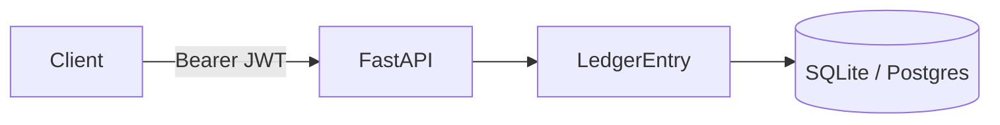

# Architecture

- `/health` is public and does not leak environment details.
- `SECRET_KEY` comes from the environment. There is no default and no login with a published password.
- CORS is an allowlist (`CORS_ORIGINS`), not `*`.
- `/api/v1/entries` requires a valid JWT.
