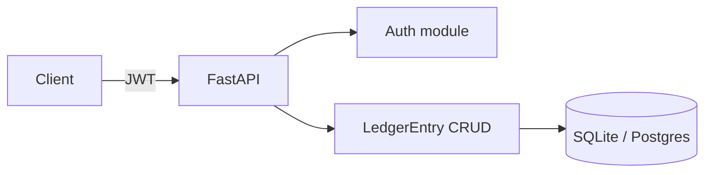

# Architecture

- Public healthcheck without auth.
- Login issues an HS256 JWT (8h).
- `/api/v1/entries` is protected and persisted via SQLAlchemy.
- Swap `DATABASE_URL` to Postgres without code changes.
